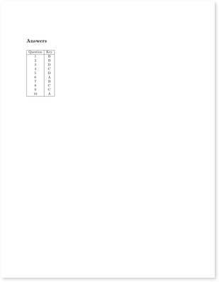

# Easy in-class Quiz

This repo shows how to make a 1-page multiple choice quiz in Markdown. The quiz is designed to be printed on a single sheet of paper, front and back. The front side has the instructions and the back side has the questions.
See [this example PDF output](https://github.com/kljensen/easy-in-class-quiz/blob/main/docs/example-output.pdf)
and the thumbnails below.

<div style="display: flex; flex-wrap: wrap; gap: 10px;">
    
    
    
</div>


## Motivation

1. I'm giving more in-class quizzes these days due to the prevalence
   of generative AI. 
2. I want to use as few trees as possible.
3. I want to write my quiz questions in Markdown but typeset them in LaTeX.

Markdown is better than
LaTeX because it makes it easier for me, TAs, and AI to write my
quiz questions.

## Requirements

You'll need `latex`, `pandoc`, `grep`, and `make` on your system.

## Running

Customize `quiz.md` with your own questions. These look like this:

```markdown
7. A 1 gig file `foo1.csv` is appended to itself to make a 2 gig file `foo2.csv`. What is true of the `SHA1` hash of `foo1.csv` and `foo2.csv`?
- They are the same.
- The hash of `foo2.csv` is the hash of `foo1.csv` appended to itself.
- They are different but of the same length. (*)
- The hash of `foo2.csv` is twice as long as the hash of `foo1.csv`. 

8. What is common about git and blockchains? 
- They both use a Merkle tree. (*)
- They both use a linked list.
- They both are implemented in Python.
- They both use SQL under the hood.
```

The correct answer is marked with `(*)`.

Customize your instructions in `instructions.md`. This can be 
whatever you want in valid markdown, though the template assumes
it will fit in about a a quarter of a page.

To generate the PDF, run `make`. The output will be in `quiz.pdf`.

Obviously, you should customize the LaTeX template to your liking.
This is just an example of how to get started. Good luck!
